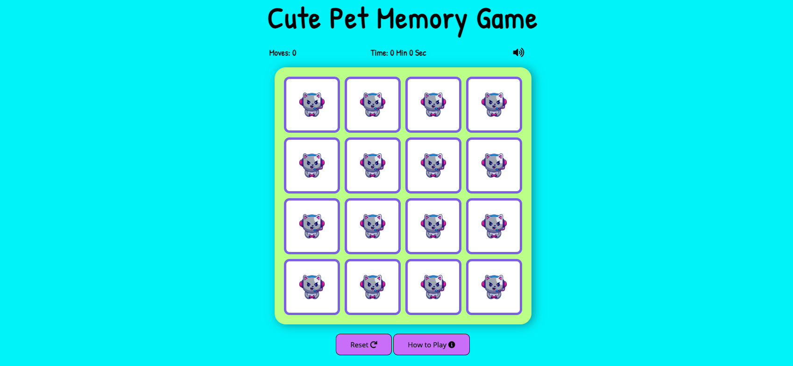

# Cute Pets Memory Game

This is a single page website that contains a simple memory game that contains 16 cards in 4x4 style grid.


[Link to website](https://sndrahel.github.io/Cute-Pets-Memory-Game/)


---
## User Stories:
---

- I want to be entertained by a simple and relaxing game.
- I would like to play a game that improves my memory.
- I would like to see my results at the end of the game.
- I'd like to play the game which has a pleasant appearance to the eye.
- I want to play a game that helps me concentrate.
- I'd like to easy see features so that everything is understandable with just one look.

---
## Five Planes:
---

#### Strategy: 
- The game aims to entertain a user for a while as well as provide with a bit of memory improvment. The game has been designed for users of any age to play and enjoy.

#### Scope:
- The game should be easy to use, have a clear layout and a customer friendly, clean and minimal navigation. 
- The cards should be shuffled on load or restart.
- The game should have a timer that counts the total time to find all pairs. 
- The game should have a move counter that count the totalt amount of moves it takes to match all pairs.
- The game should have a reset button that resets timer, moves and reshuffle the cards.
- The game should contain information on how the game went and option to play the game again.


#### Structures: 
- Single page laypout and a simple, minimal UI for ease of use.
- Function that shuffle the cards when the game is loaded. 
- A timer function that starts when the initial click is made and ends when the last pair of cards is matched.
- A move function that counts moves. 
- The game have a game over / win modal that pops up when the game is completed to congrat the user.
- The win modal contains the stats of the game with total amount of moves and time. 
- The win modal contains a option to play the game again.
- A reset button is placed below the game deck and resets the game.
- A How to Play button is placed below the game deck and pops up when clicked.   

#### Skeleton: 

- [Desktop Wireframe](wireframes/desktop_wireframe.png)
- [Mobile Wireframe](wireframes/mobile_wireframe.png)
- [Tablet Wireframe](wireframes/tablet_wireframe.png)


#### Surface: 
- Minimal interface.
- With a plain and simple layout that allows the user to focus on the game.

---
## Features:
---

### Existing Features:

#### Game Page



The layout is simple with a card deck on a plain background that allow the user to focus on the game cards. The card deck contains 16 cards in 4x4 style grid. The card deck has been styled with some shadow to provide a minor 3-D effect. 
A score area is positioned above the deck and it contain a move counter, a timer and a mute button.
Below the deck is a reset button and a information button of how to play the game.  

#### Score Area


- Time counter counts time of how long it takes the user to complete the game. Timer starts when the first card is clicked.
- Move counter counts the amount of moves it takes the user to complete the game. Counter starts when the first card is clicked.
- Mute button mute all sounds in the game.


#### Game Deck and Cards


- Game cards is clickable, and turn on click.
- When there´s a match, cards will stay visible and be disabled from click.


#### Button Area


- Reset Button resets the whole game.
- How To Play Button pops up when clicked and contains information of how to play the game.


#### How to play modal


- Short information of how to play the game.
- Contains a "Play Game!" button that returns to the game when clicked.


### Game Over / Win Modal


- Win modal pops up when game is completed.
- Contains information of the total amount of moves and time it took the user to complete the game.
- Play Again Button: Resets the game and restarts the game. 

___
### Features Left to Implement:

- Scoreboard that records the users score. 
- More alternitiv to choose difficulty modes.


----
## Technologies used:
---

- HTML 5
- CSS 3
- JavaScript
- [Balsamiq Wireframes](https://balsamiq.com/wireframes/) - For creating wireframes for initial visual development.
- [FontAwesome](https://fontawesome.com/) - For icons.
- [Google Fonts](https://fonts.google.com/) - To import the font-family used in this website: Patrick Hand and Open Sans.
- [GitHub](https://pages.github.com/) - Used to host respository.
- [GitHub Pages](https://github.com/Sndrahel/Cute-Pets-Memory-Game/settings/pages) - Used to deploy this site.
- [Google Chrome Development Tools](https://developers.google.com/web/tools/chrome-devtools) - Used for testing code on various device sizes during deployment and debugging.
- [Am I responsive](http://ami.responsivedesign.is/#) - Was used to generate a mockup for this readme.
- [Coolors](https://coolors.co/palettes/trending) - For styling the page.


---  
## Testing:
---

### Validator Testing:

- [W3C HTML Validation Service](https://validator.w3.org/) - Check HTML = No errors where found.
- [(Jigsaw) Validator](https://jigsaw.w3.org/css-validator/) - Check CSS = No errors shown.
- [Beautify Tools](https://beautifytools.com/javascript-validator.php) - Check JS = No errors where found.

### This project was tested with the following browsers: 
---

- Laptop MacOS Big Sur (ver 11.4):
  - Google Chrome
  - Safari Browser
  - Firefox

- Mobile device Huawei P30 Pro:
  - Google Chrome
  - Huawei Browser

- Mobile device IPhone 11:
  - Safari Browser

#### With each device and browser the following steps were taken:
- Test if the game card are clickable and behaves as expected.
- Test if the timer starts at right time and keep track of time. 
- Test if the move counter counts correct amount of moves. 
- Test if the "How To Play Btn" works and trigger a pop up.
- Test if the "Play Btn" close the "How To Play" modal.
- Test if the "Reset Btn" resets the game to start again.
- Test if the "Win Modal" pops up in the end of the game.
- Test if the "close module" and the "Play Again Btn" works as expected.
- Test if the "mute Btn" mutes all game sounds.


---
### Issues / Unfixed Bugs:
- Safari Browsers: Don´t support the function of the game, cards don´t flip as expected / or stay flipped - Not Fixed.
- Move counter: Doesn´t count moves correctly - Not fixed.
- Mute button: Isn´t working. Code not completed. - Not fixed. 
---

  
---
## Deployment
---
The site was deployed to GitHub pages using the following steps:

- Navigate to the [GitHub Repository Pages](https://github.com/Sndrahel/Cute-Pets-Memory-Game). 
- Go to the [Settings](https://github.com/Sndrahel/Cute-Pets-Memory-Game/settings) page and scroll down to the GitHub Page section.
- Select the main branch and save.
- After the page refreshes, the link to the live page will be in the GitHub Page section.

To run this project locally:

- Navigate to the [GitHub Repository Pages](https://github.com/Sndrahel/Cute-Pets-Memory-Game). 
- Click on the code and copy the URL to clone with HTTPS.
- In a terminal with git installed navigate to the directory where you want the repository to be cloned.
- Run 'git clone' followed by the URL you copied:
- ```git clone https://github.com/Sndrahel/Cute-Pets-Memory-Game.git```

  
---
## Credits
---

#### Content:

- [Free Code Camp](https://marina-ferreira.github.io/tutorials/js/memory-game/) - Inspiraton of the code and styling are through out inspired and taken from this tutorial. 
- [Youtube](https://www.youtube.com/watch?v=ZniVgo8U7ek) - Inspiraton of the code and styling are through out inspired and taken from this tutorial.
- [Scotch](https://scotch.io/tutorials/how-to-build-a-memory-matching-game-in-javascript) - Inspiration of the code was also taken from this tutorial.
    

#### Media:
- [Catalyststuff / Freepik](https://www.freepik.com/catalyststuff) - All images for this game is taken cropped from this site.  


#### Audio:
- [Freesound](https://freesound.org/) - All sound are taken from this site.
 
---
## Acknowledgments:

- Nishant Kumar: my Code Institute mentor who guided me through this process and shared a lot of valuable knowledge.